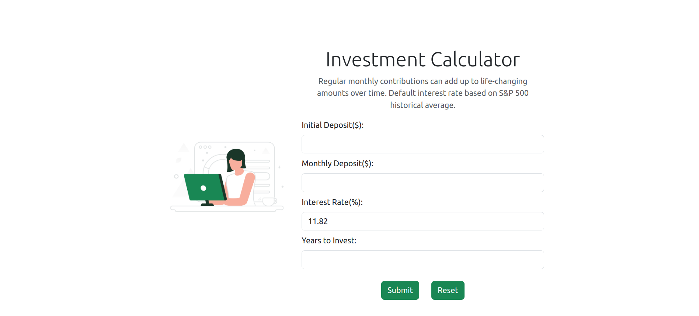
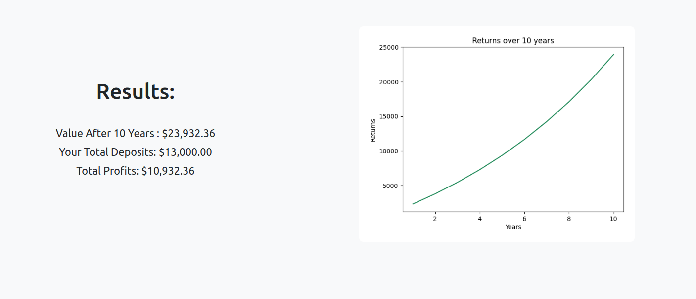

# Loan and Investment Calculators Website

This project is a flask app that features a loan calculator and an investment calculator. The site is built primarily using the Flask framework.
Other technologies used include vanilla javascript, css and alpine.js. The python library matplotlib is used to generate custom graphs and charts for every calculation.

[View Live Version](https://tbator1.pythonanywhere.com/)

